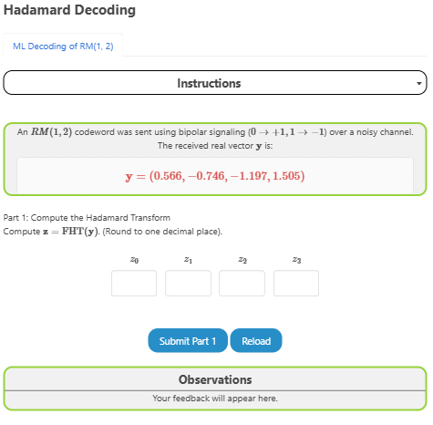
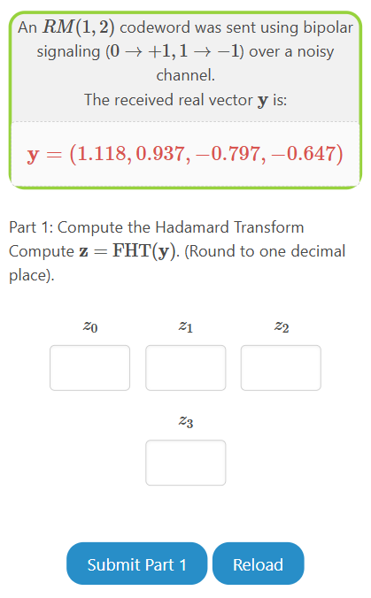
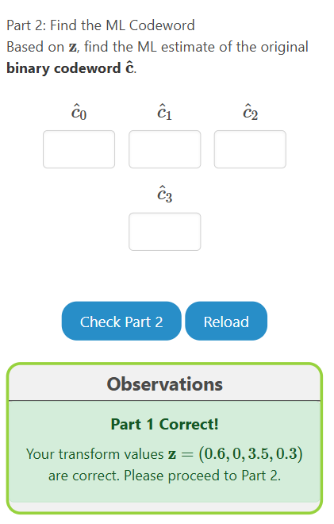

The experiment consists of one tasks, which has two subparts.

1. Compute the Hadamard Transform of given received vector.
2. Output the ML estimate of the codeword sent.

### Overview of the Experiment window

The experiment window consists of the following components:

1. **Task tab**: The task tab contains the list of tasks that need to be performed in the experiment. The user can navigate to any task by clicking on the corresponding task in the task tab.
2. **Instruction box**: The instruction box displays step-by-step instructions to perform the task.
3. **Question box**: The question box displays the question to be answered by the user.
4. **Observation box**: The observation box displays the feedback messages based on the user's input.
5. **Action box**: The action box contains the input elements and buttons to perform the task.

    

### Experiment:

There is one task in this experiment.

#### Task: ML Decoding of First Order RM Codes

1. Given received vector, compute the Hadamard Transform of the vector.

    

2. Based on the Hadamard Transform, estimate the codeword sent. Enter your answer in binary form and not the bipolar form.

    

